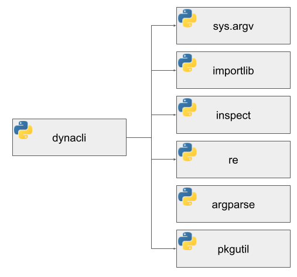

# How DynaCLI Works

DynaCLI library is a _simple_ preprocessor for the [argparse](https://docs.python.org/3/library/argparse.html) standard Python library. It scans the [sys.argv](https://docs.python.org/3/library/sys.html) array to process command line arguments one by one, uses the [importlib.import_module](https://docs.python.org/3/library/importlib.html#importlib.import_module) function to bring in feature packages/modules and command modules, uses the [inspect.signature](https://docs.python.org/3/library/inspect.html#inspect.signature) to understand command function arguments and the [re.match](https://docs.python.org/3/library/re.html#re.match) function to extract help string per argument. If it encounters a StopIteration or ModuleNotFound exception, it will use the [pkgutil.iter_modules](https://docs.python.org/3/library/pkgutil.html) function to build help for available features and commands.

The overall structure of DynaCLI library is illustrated below:

