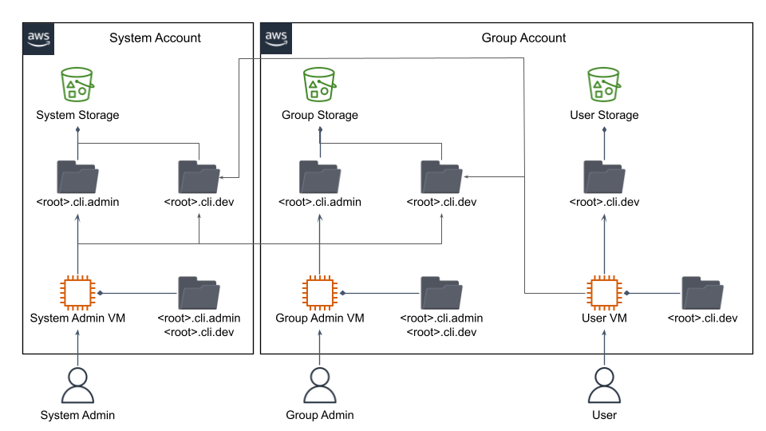

# DynaCLI search path and root packages

DynaCLI is supposed to be easy to use in easy cases and at the same time extremely flexible and cloud friendly. The last concept deserves some extra explanations.

The DynaCLI was conceived to address special needs of the [Cloud AI Operating System (CAIOS)](https://medium.com/@CAIOStech/improve-devsecops-10x-by-embracing-caios-c0ace31a3f33) project, which employs a special custom [Python Cloud Importer](https://asher-sterkin.medium.com/serverless-cloud-import-system-760d3c4a60b9) as the major underlying technology. Briefly, the main idea behind the [CAIOS Python Cloud Importer](https://asher-sterkin.medium.com/serverless-cloud-import-system-760d3c4a60b9) is that developers do not need to `pip install` anything, but just to `import what_your_need` from the cloud storage.

Here, we could envision at least three types of cloud storage where importable artifacts could be located:

* the main system cloud storage shared by everybody (System Storage on the diagram below)
* cloud storage of a particular system installation shared by a group of developers (Group Storage on the diagram below)
* individual developer's storage (User Storage on the diagram below)

Therefore, when a developer types `import something` this `something` could be imported from her personal User Storage, Group Storage shared with developers from her group, and System Storage shared with all developers. In fact, this is just a most the most typical system configuration. By itself DynaCLI does not limit how many which types of storage should be in the system as long as they all are supported by the underlying Python Import System. Regardless of how many storages there are, each such storage should be reflected in the DynaCLI search_path list.

On the other hand, in general case, not all commands should be available to any user. Some commands are intended for developers but could be occasionally used by administrators. Some other commands should be available only for administrators of particular system installations (Group Administrator on the diagram below), while some other commands should be available for the system administrators. We, therefore need some form of command access control, be it [Role-Base Access Control (RBAC)](https://en.wikipedia.org/wiki/Role-based_access_control) or even [Attribute-Based Access Control (ABAC)](https://en.wikipedia.org/wiki/Attribute-based_access_control).

DynaCLI addresses this need by assuming that each set of commands intended for particular group of users (developers, administrators, etc.) is located under a particular Python Root Package and allows to configure them as a separate list in DynalCLI entry point.

Notice that DynaCLI entry point does not have to be static. It could be dynamically generated at, say, system installation.

Combing these two mechanisms, we come up with a many-to-many types of configurations, namely, that each type of storage might contain different root packages with commands intended for different types of users. This virtually unlimited flexibility in system configuration, is what makes DynaCLI so different from any other Python CLI framework.

Assuming AWS as a cloud platform (it will work equally well for any cloud, we just want to be specific), the diagram below illustrates a typical system configuration of 3 types of storage (System, Group, User) and two types of users (Developer, Administrator) accesses from two AWS cloud accounts:

[](../img/dynacli_search_paths_and_root_packages.png)

Notice, that DynaCLI search path and root package configuration is not limited to cloud storage only (in this example AWS S3). Some artifacts could still be imported from a local disk for boostrap or access time optimization purposes. There is virtually no limit in what could be achieved here.

TODO: Shako to check if anything from below should be retained

For DynaCLI search path has special meaning - it can use local packages or modules or those are stored in the cloud.
There is no difference either it is getting imported from S3 or from the local machine.

Also, you can divide the functionality of your CLI - there can be situations where we need to provide some features for administrative users
, and some features to the developers. So, basically you can provide different search paths, and it will be reflected accordingly:


Here we have 2 different CLIs `testcli` and `testcliadmin`. Accordingly, `testcliadmin` will see all features for the `dev` (`testcli`), because it is an admin:

For Developers:

```console
$ ./testcli -h
usage: testcli [-h] [-v] {destroy,feature-A,service,update,fake,feature-B,the-last,upload} ...

Sample DynaCLI Tool

positional arguments:
  {destroy,feature-A,service,update,fake,feature-B,the-last,upload}
    destroy             Destroy given name...
    feature-A           Does something useful
    service             This is an example of module feature
    update              Updates everything...
    fake                [ERROR] Missing the module docstring
    feature-B           Does something extremely useful
    the-last            This is an example of module feature
    upload              This is an example of module feature

optional arguments:
  -h, --help            show this help message and exit
  -v, --version         show program's version number and exit
```

Administrators:

```console hl_lines="12 17"
$ ./testcliadmin -h
usage: testcliadmin [-h] [-v] {destroy,feature-A,service,update,feature-C,fake,feature-B,the-last,upload,feature-D} ...

Sample DynaCLI Tool

positional arguments:
  {destroy,feature-A,service,update,feature-C,fake,feature-B,the-last,upload,feature-D}
    destroy             Destroy given name...
    feature-A           Does something useful
    service             This is an example of module feature
    update              Updates everything...
    feature-C           For admin users
    fake                [ERROR] Missing the module docstring
    feature-B           Does something extremely useful
    the-last            This is an example of module feature
    upload              This is an example of module feature
    feature-D           Do not forget about this feature for admins

optional arguments:
  -h, --help            show this help message and exit
  -v, --version         show program's version number and exit
```

As you have noticed new 2 features were registered (`feature-C`, `feature-D`), they can be either from cloud or from the local.
