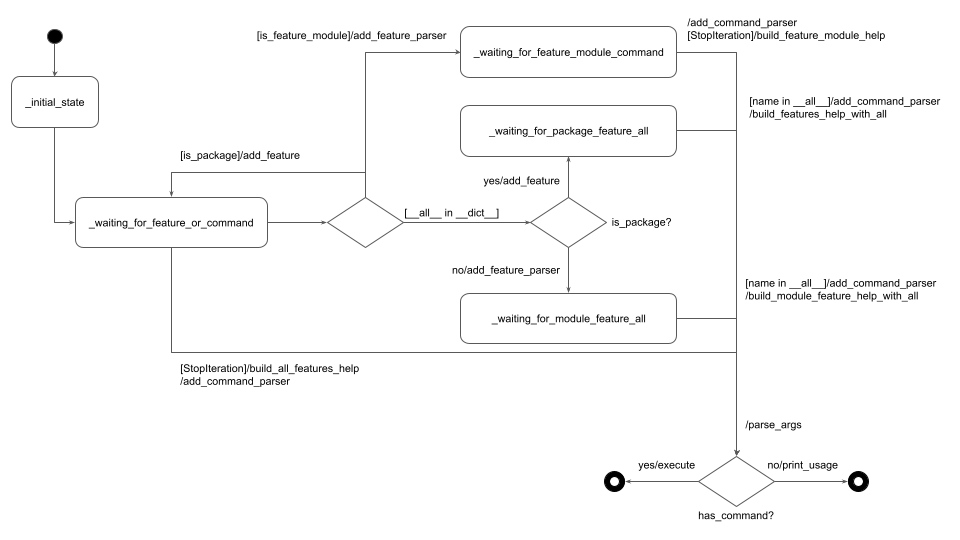
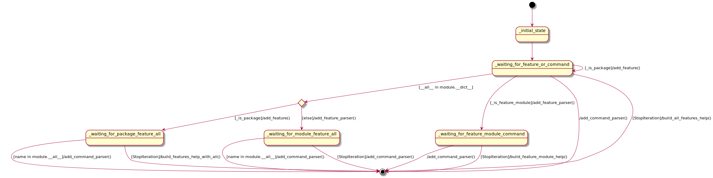

# DynalCLI State Machine

Internally, DynaCLI main routine is implemented by applying the [State Design Pattern](https://en.wikipedia.org/wiki/State_pattern) (more specifically, _function_for_state_, but these are internal details) using a state machine for keeping track of the command line arguments processing progress. At high-level, this state machine, illustrated using the lightweight [UML Statecharts](https://en.wikipedia.org/wiki/UML_state_machine) notation, is presented below:

[](../img/dynacli_statemachine.png)

We treat every command line argument as a trigger trying to figure out what to do about it:

* the first entry of sys.argv is treated as a DynaCLI entry point, from which we extract high-level description and version info, if any (_initial_state on the diagram)
* every next argument is treated as a Python module name, imported using the [importlib.import_module](https://docs.python.org/3/library/importlib.html#importlib.import_module) function (_waiting_for_feature_or_command state on the diagram)
* if import fails, or there are more entries in sys.arg, help for all available features (at the current level) is generated using the [pkgutil.iter_modules](https://docs.python.org/3/library/pkgutil.html) function
* if import succeeds, the imported module is analysed whether it has an `__all__` specifier or not (we follow Python convention with regard to `__all__` specification)
* if it does have `__all__`, then based on whether it's a Python package or module, the processing transits to either `_waiting_for_package_feature_all` or `_waiting_for_module_feature_all` state (see bellow more detailed description)
* otherwise, if imported module is a package, we extract the package help and version info, if any, using the `__init__.py` file docstring and `__version__` specification and push the [argparse](https://docs.python.org/3/library/argparse.html) parsers hierarchy one level down
* if it's a regular module, we check if it has a function with the same name
* if it does have a function with the same name, we treat it as a command module, build complete command parser by analysing the function signature and docstring, and transit to the final processing
* if it does not have a function with the same module, we treat it as a feature module (each public function will be treated as a command) and transit to _waiting_for_feature_module_command_state
* in the _waiting_for_package_feature_all state, we check whether the next sys.argv entry is in the `__all__` list; if it is we perform a normal state selection process outlined above, if it is not, we print a help for this feature package
* in the _waiting_for_module_feature_all state, we check whether the next sys.argv entry is in the `__all__` list; if it is we treat it as a command, if it is not, we print a help for this feature module
* in the _waiting_for_feature_module_command, we check whether the next sys.argv entry points to a public function within this module; if it does we treat it as a command, if it does not, we print a help for this feature module
* at the final stage, we invoke the [argparse](https://docs.python.org/3/library/argparse.html) standard parsing mechanism, check whether a pointer to command function was obtained and either execute this command if it was, or print usage message ([argparse](https://docs.python.org/3/library/argparse.html) will print an error message if something was wrong)

## Why [argparse](https://docs.python.org/3/library/argparse.html) at all?

One could argue that DynaCLI actually uses the [argparse](https://docs.python.org/3/library/argparse.html) for printing help and usage messages while actual processing is done by the DynaCLI internal machinery. If so, the question would be "why to use the [argparse](https://docs.python.org/3/library/argparse.html) at all".

First, this observation is correct. Second, we wanted to retain the [argparse](https://docs.python.org/3/library/argparse.html) message formatting, which is considered as de-facto standard. Third, considering limited resources and specific needs of the main CAIOS project, we did not want to invest in excavating help and usage message formatting from the [argparse](https://docs.python.org/3/library/argparse.html) internals. While it might add some minor performance overhead we considered it negligible and worth our development effort savings.

TODO: Shako to check whether anything from below still needs to be retained
Each state corresponds to a different level.

Effectively, we have 3 main states: feature as a package handler, feature as a module handler and command handler.

But there is a different state called `__all__` handler for going through a different path if there is a `__all__`
indicated at feature as a package level and feature as a module level.

There is no need to indicate `__all__` at top level command because it makes no sense.

Basically, we treat each CLI sequence of the commands as different states:

```console
$ ./testcli <feature> <command> -h
```

States in this CLI run is described below:

At each iteration we find ourselves in specific state, yes we use State Design Pattern:

First iteration -> `testcli` - the script itself is an initial state.

Second iteration -> `<feature>`- feature as package or feature as module state.

Third iteration -> `<command>` - command state.

Fourth iteration -> Iterator is exhausted and raised StopIteration that means we are going to build command help.

Let's describe some more variations:

Variations:

`./testcli -h` : initial state - StopIteration - build all features help

`./testcli <feature as package> -h` : initial state - add feature as parser - StopIteration - build feature help

`./testcli <feature as module> -h` : initial state - add feature as parser - StopIteration - build feature as module help

`./tescli <feature> <command> -h` : initial state - add feature parser - add command parser - StopIteration - build command help

`./tescli <feature> <command> arg1 arg2 …` : initial state - add feature parser - add command parser - register arguments - execute the function

And based on the fact that if `__all__` was found we got different path to follow but the main idea is to have states for each path.

[](../img/state_machine.png)

!!! note

    To explore pUML please click and open the photo in large size